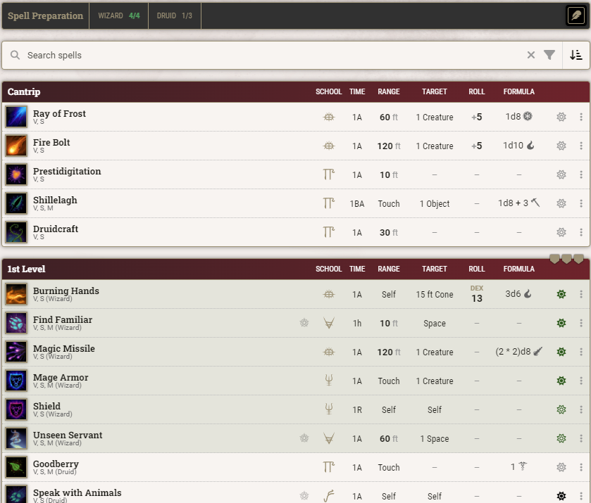

# VoodooFrog's 5e Sheet Addons

&color=%2388ff00)

## Basic Information

This module adds some functionality to the new default 5e system character sheet for Foundry VTT:
* Show spell preparation information on the spells tab.
* Handle setting up class sources for preparable spells.
* Tighter controls around item identification.

Right now, this is just in beta, but it's pretty stable and seems to work well.

### Prepared Casters
For each prepared caster defined in the module (Artificer, Cleric, Druid, Paladin, and Wizard) it will, by default, show a bar at the top of the Spells tab which gives the spell preparation limit for the class.

Even better, it includes a means to set the class source of your spells so that you can actually see when you are hitting the limits or exceeding the preparation limits for each of your prepared caster classes. Or if you prefer you can set it to do a very simple calculation of the total of all the spell preparation limits for each valid class on the character. Either way, the limits are then used to determine the colour of the spell preparation icons by each _preparable_ spell — green if the total limit is hit, and red if it is exceeded.

There are settings in the module too, so that these features can be turned on or off, and if you have any custom preparation style casting classes there is a menu in the settings to add their class names. Note that when entering these names you should use the name as it appears on the Spells tab of the sheet, title case and all. I may change this in the future to use the actual class identifier, but it works as is for now.

### Item Identification
You can set a minimum user role to show the identification options to — this includes the context menu on the character sheet as well as the toggle at the top of the item sheet.

Furthermore, you can enable/disable the showing of the attunement control next to unidentified items for users that are below the required permission level.

**Note**: _If you set the permissions to Game Master role then Assistant GMs will still be able to see/access some things by default. You'd have to actually modify the core permissions to truly lock it down, but I left the option in there for those that might want it._

### Manager for Added Spells
There's a neat convenience feature you can turn on in the module's settings that handles spells as they're added to an actor (it is off by default). Essentially it will pop up a window showing all the spells you're adding and allow you to change the preparation mode for them. If spell sources are enabled, this window will also allow you to set the source.

## Install
Manifest: `https://github.com/voodoofrog/vf-5e-sheet-addons/releases/latest/download/module.json`

### The Module In Action

